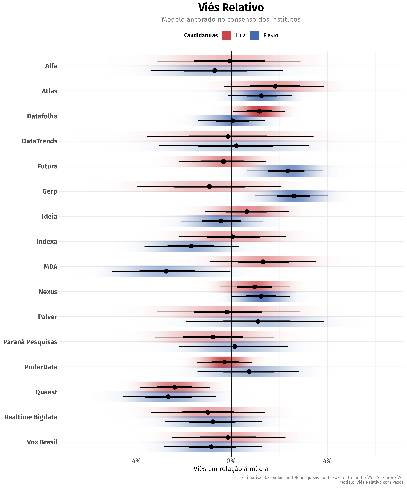
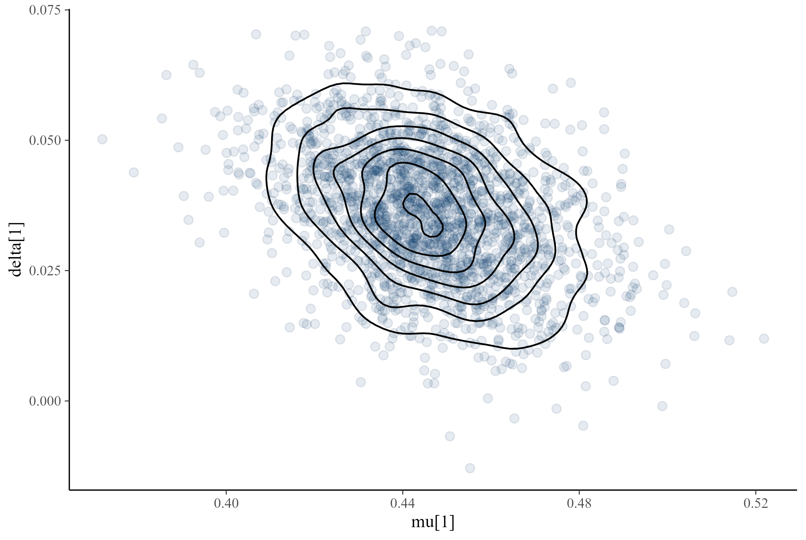
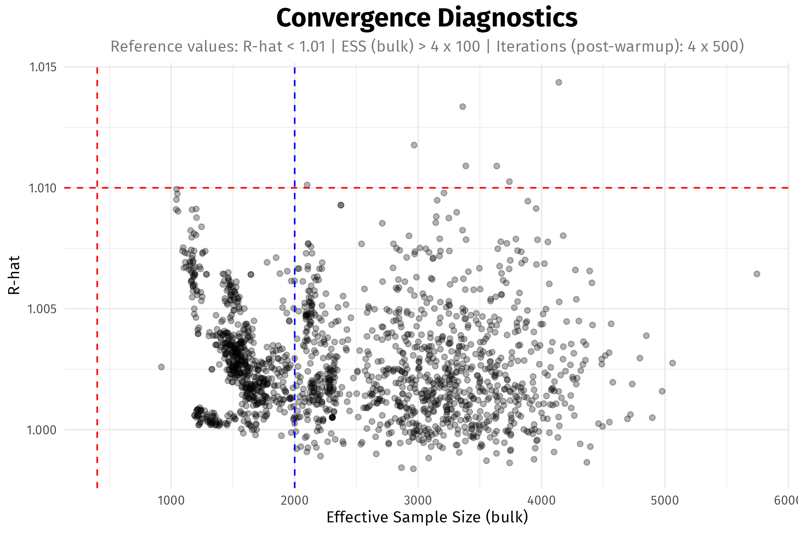

# agregR <a href="https://github.com/rnmag/agregR/"></a>

<!-- badges: start -->

[](https://cran.r-project.org/package=agregR)
[](https://app.codecov.io/gh/rnmag/agregR)
[](https://github.com/rnmag/agregR/actions)

<!-- badges: end -->

🇧🇷 **Novidade**: [acompanhe](articles/agregador.html) os resultados atualizados do agregador

**Bayesian State-Space Aggregation of Brazilian Presidential Polls**

As presidential elections approach, Brazilian voters are confronted with a growing
volume of conflicting polling estimates, each employing distinct methodologies and
sampling designs. `agregR` provides a rigorous framework to filter the surfeit
of data and uncover the underlying level of support for each candidate.

The package implements a set of Bayesian state-space models in
[Stan](https://mc-stan.org/) to normalize polling data from sources that are noisy
and possibly biased. It features methods to account for:

- House effects
- Pollster performance in past elections
- Asymmetric accuracy based on candidates’ political alignment
- Polls reporting inflated precision
- Heterogeneous errors for round 1 and round 2 elections
- Non-sampling errors, such as design effects and non-ignorable
  non-response bias

## Table of Contents

- [Installation](#installation)
- [Basic Usage](#basic-usage)
  - [Estimation](#estimation)
  - [Visualization](#visualization)
  - [Advanced Configuration](#advanced-configuration)
- [Methodology](#methodology)
  - [Introduction](#introduction)
  - [Conceptual Framework](#conceptual-framework)
  - [Data Quality](#data-quality)
  - [Models Overview](#models-overview)
- [Model Validation](#model-validation)
  - [Posterior Predictive Checks](#posterior-predictive-checks)
  - [Posterior Geometry and Convergence](#posterior-geometry-and-convergence)
  - [Sampling Efficiency](#sampling-efficiency)
- [References](#references)

## Installation

`agregR` is built on [CmdStan](https://mc-stan.org/docs/cmdstan-guide/),
the state-of-the-art backend for Stan. Since CmdStan is not available on
CRAN ([and will likely never
be](https://discourse.mc-stan.org/t/what-is-the-difference-between-rstan-cmdstanr-and-bridgestan/39226/3)),
it needs to be installed separately. This one-time setup yields
substantial gains in compilation speed and sampling performance.

We recommend following these installation steps in order:

### 1. Install compiler

**Windows** users must first install
[RTools](https://cran.r-project.org/bin/windows/Rtools/) to enable C++
compilation. **MacOS** requires [Xcode Command Line
Tools](https://developer.apple.com/documentation/xcode/installing-the-command-line-tools/),
and **Linux** users should install the distribution-specific compiler
(e.g., Ubuntu: `sudo apt install build-essential`).

### 2. Install CmdStan

The most convenient way to install CmdStan is via the `cmdstanr` interface.

``` r
# Install cmdstanr interface
install.packages("cmdstanr", repos = c("https://stan-dev.r-universe.dev", "https://cloud.r-project.org"))

# Install CmdStan
cmdstanr::install_cmdstan()
```

Optional: make sure everything is in place.

```r
cmdstanr::check_cmdstan_toolchain()
```

### 3. Install `agregR`

You can install the stable version of `agregR` from CRAN with:

``` r
install.packages("agregR", type = "source")
```

**Experimental**: the development (and possibly unstable) version of `agregR`
can be installed with:

``` r
if (!require(pak)) install.packages("pak")
pak::pak("rnmag/agregR")
```

## Basic Usage

### Estimation

The main function `rodar_agregador()` centralizes data preparation, model
compilation, and sampling. It returns the full `CmdStanMCMC` objects for
diagnostics, along with tidy data frames for house effects and daily
voting estimates.
``` r
library(agregR)

# Execute the aggregation pipeline for a 2nd round scenario
result <- rodar_agregador(
  data_inicio = "01/06/2025",
  turno = 2,
  cenario = "Lula vs Flávio",
  modelo = "Viés Relativo com Pesos"
)

# Daily voting estimates + poll data in tidy format
result$votos_estimados

# House effects in tidy format
result$vies_institutos

# Raw model object
result$modelo_bruto
```

### Visualization

The package includes a suite of plots designed for public communication.

We strongly recommend **RStudio** users to
[enable the AGG graphics device](https://posit.co/blog/rstudio-v1-4-preview-little-things#render-plots-with-agg)
in `Options -> General -> Graphics -> Backend`.

#### 1. Voting Intentions

Visualizes the estimated voting intention for each candidate overlaying the raw
polling data.

``` r
grafico_agregador(result)
```


#### 2. House Effects

Visualizes the systematic bias for each institute, identifying consistent directional skews.

``` r
grafico_vies(result, candidaturas = c("Lula", "Flávio"))
```



#### 3. Bayesian Updating Check

Visualizes how the data has informed the model by comparing prior
vs. posterior distributions for selected parameters.

``` r
grafico_priori_posteriori(result, tipo = "Viés", candidaturas = c("Lula", "Flávio"))
```


### Advanced Configuration

The package offers configuration functions for fine-grained control over
plots and models. Configuration values can be stored in new objects using
the functions `configurar_agregador()`, `configurar_prioris()` and
`configurar_grafico()`. Alternatively, they can be passed directly as lists
to the appropriate arguments.

``` r
# Config passed as list: longer run with tighter priors for non-sampling error
result_custom <- rodar_agregador(
  turno = 2,
  cenario = "Lula vs Flávio",
  config_agregador = list(stan_chains = 4,
                          stan_iter = 2000,
                          stan_warmup = 2000),
  config_prioris = list(sd_tau_priori = 0.01)
)

# Config passed as function: custom color and custom symbols
grafico_agregador(
  result, 
  config_grafico = configurar_grafico(
    cores_candidaturas = c("Flávio" = "yellow"),
    simbolos = c("Presencial" = 19, "Online" = 2, "Telefônica" = 4)
  )
)

# Config passed as object: custom color
config_custom <- configurar_grafico(cores_candidaturas = c(Lula = "green"))

grafico_agregador(result, config_grafico = config_custom)
```

## Methodology

### Introduction

We are interested in performing inference on the **latent state** of public opinion:
the dynamic, unobserved level of support for each candidate. Polls are periodic
snapshots of this state, but the pictures are distorted and grainy.

An apt analogy is a GPS receiver navigating an area with spotty connectivity.
It receives sparse, conflicting pings from different satellites, each with its
own uncertainty due to corrupted data packages, equipment miscalibration or
inherent manufacturer bias. The system must achieve three objectives:

1. **Data Reconciliation**: It must filter the noise from competing sources to
   resolve a definitive vehicle position.
2. **Path Estimation**: It must reconstruct the trajectory between data points,
   since movement continues even when satellites lose track of the vehicle.
3. **Joint Parameter Updating**: As new data arrives, the system must simultaneously
   update the vehicle's position and re-evaluate the reliability of each satellite.

Much like satellites, pollsters might be miscalibrated. Their readings
contain noise introduced by different sampling designs, weighting protocols,
and question wording, among other factors. `agregR` shares the same objectives
as the GPS receiver:

 1. **Data Reconciliation**: It filters the noise from competing pollsters to
    isolate the latent state of candidate support.
 2. **Path Estimation**: It reconstructs the trajectory of public opinion during
    polling gaps, ensuring a continuous estimate even when data is unavailable.
 3. **Joint Parameter Updating**: As new polls are published, it simultaneously
    updates candidate support levels and re-evaluates the reliability of each pollster.

### Conceptual Framework

The methods implemented by `agregR` build on Jackman (2009). They are variously
known as state-space models (SSM), dynamic linear models (DLM) or Kalman filters
and consist of two integrated components:

1. A **state model** that estimates the underlying trajectory of candidate
   support in the periods between polling releases.
2. A **measurement model** that filters incoming observations and updates
   institute-specific biases. It decomposes uncertainty into sampling error
   ($\sigma$), house effects ($\delta$), and an additional non-sampling error
   term ($\tau$) inspired by Heidemanns, Gelman & Morris (2020).

#### State Model

The latent voting intention for each candidate updates daily according
to a local linear trend. The evolution of the latent state through time $t$
for candidate $c$ is governed by the **level component** $\mu_{t, c}$ and
influenced by the **trend component** $\nu_{t, c}$.

The level $\mu_{t, c}$ is defined by the previous state $\mu_{t - 1, c}$ plus
the trend $\nu_{t - 1, c}$, subject to stochastic level innovations $\eta_{t, c}$.
The trend itself evolves as a random walk driven by innovations $\zeta_{t, c}$.

$$  \begin{pmatrix}\mu_{t, c} \\
    \nu_{t, c}\end{pmatrix} =
    \begin{pmatrix}1 & 1 \\
    0 & 1\end{pmatrix}
    \begin{pmatrix}\mu_{t - 1, c} \\
    \nu_{t - 1, c}\end{pmatrix} +
    \begin{pmatrix}\eta_{t, c} \\
    \zeta_{t, c}\end{pmatrix}
$$

The volatility parameters govern the “stiffness” of the aggregator, where daily
innovations $\eta_{t, c}$ and $\zeta_{t, c}$ are regularized by candidate-specific
scales $\omega_{\eta, c}$ and $\omega_{\zeta, c}$, respectively. Pooling across
the time series prevents the model from reacting to noise, but leaves room for
adaptation when consistent evidence of a shift in public opinion emerges.

$$  \begin{align}
    \eta_{t, c} &\sim N\left(0, \omega^2_{\eta, c}\right) \\
    \zeta_{t, c} &\sim N\left(0, \omega^2_{\zeta, c}\right)
    \end{align}
$$

#### Measurement Model

When polling data $i$ for candidate $c$ is available, the observed result
$y_{i, c}$ from pollster $j$ at time $t$ is modeled as a function of the
latent state $\mu_{t(i), c}$ and house effects $\delta_{j(i), k(i), p(c)}$:

$$  y_{i, c} = \begin{pmatrix}1 & 0\end{pmatrix} 
               \begin{pmatrix}\mu_{t(i), c} \\
               \nu_{t(i), c}\end{pmatrix} + 
               \delta_{j(i), k(i), p(c)} + 
               \varepsilon_{i, c}
$$

where

$$
\varepsilon_{i, c} \sim N\left(0, \sqrt{\sigma_{i, c}^2 + \tau_{j(i), k(i), p(c)}^2}\right) 
$$

with subscripts linking poll $i$ and candidate $c$ to relevant covariates:

- $t(i)$: Date of fieldwork
- $j(i)$: Polling institute
- $k(i)$: Election round
- $p(c)$: Political alignment for candidate $c$
  ($p \in \{\text{left, right, other}\}$).

In the error term $\varepsilon$, $\sigma$ represents a lower bound of uncertainty
from sampling theory, whereas $\tau$ captures the excess empirical variance required
to model overdispersion. This non-sampling error parameter accounts for the fact
that published interval estimates sometimes entirely miss the election results, and
can be used to downweight inaccurate pollsters (see [Models Overview](#models-overview)).

The scale parameters for $\delta$ and $\tau$ are calibrated to address polling sparsity
in the early stages of the election cycle, allowing the model to transition gracefully
from a prior-dominated regime to a data-dominated one as the volume of polling increases[^1].
Specific values for priors can be modified by the `configurar_prioris()` function,
and details are available in its documentation.

[^1]: Partial pooling struggles to identify group-level variances in low-information
environments like early campaigns, often leading to complete shrinkage or convergence
failures. Anchoring the scale parameters keeps the models robust and reliable throughout
the entire cycle.

Computationally, the measurement model is designed to prioritize high sampling
efficiency and convergence stability (see [Model Validation](#model-validation)).
The normal likelihood provides a convenient approximation of latent support for
competitive candidates whose polling numbers do not approach the 0% boundary.
Compared to the multinomial implementation proposed by Stoetzer et al. (2019),
this normal approximation yields nearly identical inferences for leading candidates,
samples significantly faster, and is far less prone to divergent transitions.

In summary, we are explicitly modeling three sources of support uncertainty in polls:

1.  **Sampling Error** ($\sigma_{i, c}$): The inherent uncertainty derived
    from the effective sample size of the poll $i$ and the support level
    for candidate $c$.
2.  **House Effects** ($\delta_{j,k,p}$): A systematic bias specific
    to pollster $j$, conditional on the election round $k$ and the
    candidate’s political alignment $p$.
4.  **Non-Sampling Error** ($\tau_{j,k,p}$): An additional error parameter
    capturing noise extrinsic to random sampling (e.g., design effects,
    non-ignorable non-response bias), also localized by pollster $j$,
    round $k$, and political alignment $p$.

### Data Quality

Polls enter the model with checks on their sample size in order to
avoid undue influence from pollsters claiming inflated precision. We calculate
an *implied* $n$ derived from the published margin of error and compare it
to the reported sample size. We use the most conservative figure $n_{eff}$ to
compute specific standard errors for each candidate $c$ according to their
vote share $v_{i, c}$ in poll $i$:

$$
\sigma_{i, c} = \sqrt\frac{v_{i, c}(1-v_{i, c})}{n_{eff[i]}}
$$

Historical data is sourced from Poder360’s polling database via [Base dos Dados](https://basedosdados.org/dataset/fb38dbe8-03ce-46b4-a6b7-638ade03999c?table=b6df9e1c-cbcb-4dbd-893b-8645a51773e6).

### Models Overview

Based on the methods described above, `agregR` offers a set of
models that differ in their assumptions regarding house effects
($\delta$) and non-sampling error ($\tau$) estimation:

- **House Effects**: Since $\mu$ and $\delta$ are not jointly identifiable, house
  effects $\delta_{j,k,p}$ follow a regularizing prior centered either on the pollsters'
  average or on electoral results. The anchor choice defines whether house effects
  are interpreted as relative deviations from the current-cycle consensus or as biases
  against observed data.
- **Non-Sampling Error**: Models using localized non-sampling errors $\tau_{j,k,p}$ 
  as prior means effectively perform **automated weighting**. This approach
  penalizes pollsters with higher Root Mean Square Error (RMSE) in the last
  election while maintaining the flexibility to update its estimates based
  on current-cycle data. Models employing a global $\tau$ give every pollster
  equal weight.

| Model | House Effects | Non-Sampling Error | Description |
|:---|:---|:---|:---|
| **Viés Relativo com Pesos** (*Weighted Relative Bias*) | Consensus $\left(\sum_j \delta_{j, k, p} = 0\right)$ | Last election $\tau_{j,k,p}$ (past RMSE $\rightarrow \tau$ prior) | A balanced model that weights pollsters by past performance and anchors biases to the current-cycle consensus |
| **Viés Relativo sem Pesos** (*Unweighted Relative Bias*) | Consensus $\left(\sum_j \delta_{j, k, p} = 0\right)$ | Global $\tau$ shared across pollsters | A "fresh-start" model that relies entirely on current-cycle data, without incorporating historical pollster performance |
| **Viés Empírico** (*Empirical Bias*) | Last election $\delta_{j,k,p}$ (past bias $\rightarrow \delta$ prior) | Last election $\tau_{j,k,p}$ (past RMSE $\rightarrow \tau$ prior) | An empirical model that leans on historical performance to inform both bias priors and pollster weights |
| **Retrospectivo** (*Retrospective*) | Actual election result $\left(\mu_T\right)$ | Global $\tau$ shared across pollsters | A "backward" model anchored to the ballot result, useful for post-election diagnostics |
| **Naive** | None | None | Baseline model |

## Model Validation

### Posterior Predictive Checks

Every Stan model in `agregR` includes a `generated quantities` block, enabling
Posterior Predictive Checks. Users can verify that the model accurately reflects
observed data by simulating poll values from the posterior distribution. The
example below demonstrates this using the `bayesplot` package.

``` r
library(bayesplot)

# Setup
cand  <- "Lula"
modelo_cand <- result$modelo_bruto[[cand]]
color_scheme_set("mix-brightblue-darkgray")

# Observed data
y <- result$votos_estimados |>
  filter(!is.na(percentual_pesquisa) & candidatura == cand) |>
  pull(percentual_pesquisa)

# Simulated data
y_rep <- modelo_cand$draws("perc_simulado", format = "matrix")

# Prepare plot labels
pesquisa_id <- result$votos_estimados |>
  filter(!is.na(percentual_pesquisa) & candidatura == cand) |>
  pull(pesquisa_id)

# Plot observed vs simulated data
ppc_intervals(y, y_rep, prob = 0.67, prob_outer = 0.95) +
  scale_x_continuous(labels = pesquisa_id,
                     breaks = seq_along(pesquisa_id)) +
  scale_y_continuous(labels = scales::label_percent()) +
  labs(title = "Simulated vs Observed Data") +
  xaxis_title(FALSE) +
  coord_flip() +
  theme_minimal() +
  theme(plot.title = element_text(face = "bold", size = 18, hjust = .5),
        panel.grid = element_blank(),
        panel.grid.major.y = element_line(linetype = "dotted", color = "gray80"),
        axis.text.y = element_text(size = 8),
        legend.position = "top")
```


### Posterior Geometry and Convergence

Parameter distributions are standardized using Non-Centered Parametrization
(Stan Development Team, [Efficiency Tuning: Reparametrization](<https://mc-stan.org/docs/stan-users-guide/efficiency-tuning.html#reparameterization.section>)).
This flattens posterior geometry and addresses the “funnel” problem common in
hierarchical models (Gabry et al., 2019), significantly improving sampling
efficiency and virtually eliminating divergent transitions in standard scenarios.

```r
# Posterior geometry for selected mu and delta parameters
mcmc_scatter(modelo_cand$draws(),
             pars = c("mu[1]", "delta[1]"),
             np = nuts_params(modelo_cand), # no divergences to display
             alpha = 0.1) +
  stat_density_2d(color = "black")
```



### Sampling Efficiency

High sampling efficiency allows for fast models without sacrificing inference quality.
Typical values for Effective Sample Size (ESS) and R-hat fall comfortably within
recommended benchmarks. Notably, many parameters exhibit an ESS exceeding the nominal
number of post-warmup iterations (blue line).


```r
# ESS (bulk) vs R-hat
ggplot(modelo_cand$summary(), aes(x = ess_bulk, y = rhat)) +
  geom_point(alpha = 0.3) +
  geom_hline(yintercept = 1.01, linetype = "dashed", color = "red") +
  geom_vline(xintercept = 400, linetype = "dashed", color = "red") +
  geom_vline(xintercept = 2000, linetype = "dashed", color = "blue") +
  labs(title = "Convergence Diagnostics",
       subtitle = "Reference values: R-hat < 1.01 | ESS (bulk) > 4 x 100 | Iterations (post-warmup): 4 x 500)",
       x = "Effective Sample Size (bulk)",
       y = "R-hat") +
  theme_minimal() +
  theme(text = element_text(family = "Fira Sans"),
        plot.title = element_text(face = "bold", size = 18, hjust = .5),
        plot.subtitle = element_text(hjust = .5, color = "#777777"))
```



## References

Gabry, J., Simpson, D., Vehtari, A., Betancourt, M., & Gelman, A. (2019).
*Visualization in Bayesian Workflow*. Journal of the Royal Statistical
Society Series A: Statistics in Society.

Heidemanns, H., Gelman, A., & Morris, G. (2020). *An Updated Dynamic
Bayesian Forecasting Model for the 2020 Election*. Harvard Data
Science Review.

Jackman, S. (2009). *Bayesian Analysis for the Social Sciences*. Wiley.

Stan Development Team. *Stan User’s Guide (Efficiency Tuning: Reparametrization)*. Retrieved from
<https://mc-stan.org/docs/stan-users-guide/efficiency-tuning.html#reparameterization.section>

Stoetzer, L. F., et al. (2019). *Forecasting Elections in Multiparty Systems:
A Bayesian Approach Combining Polls and Fundamentals*. Political Analysis.
