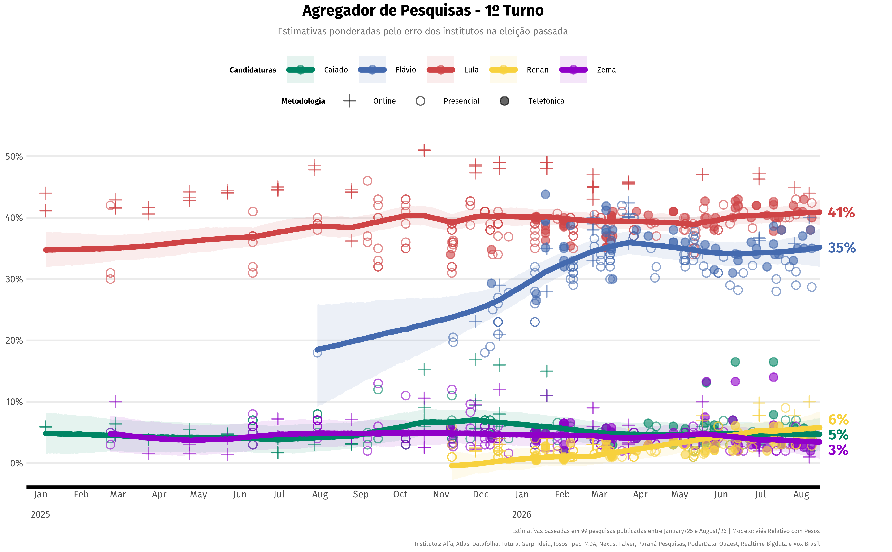
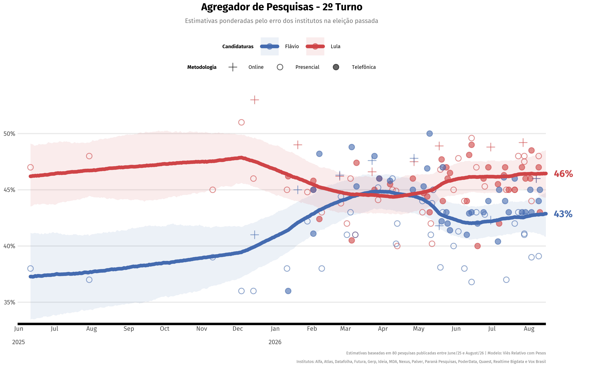
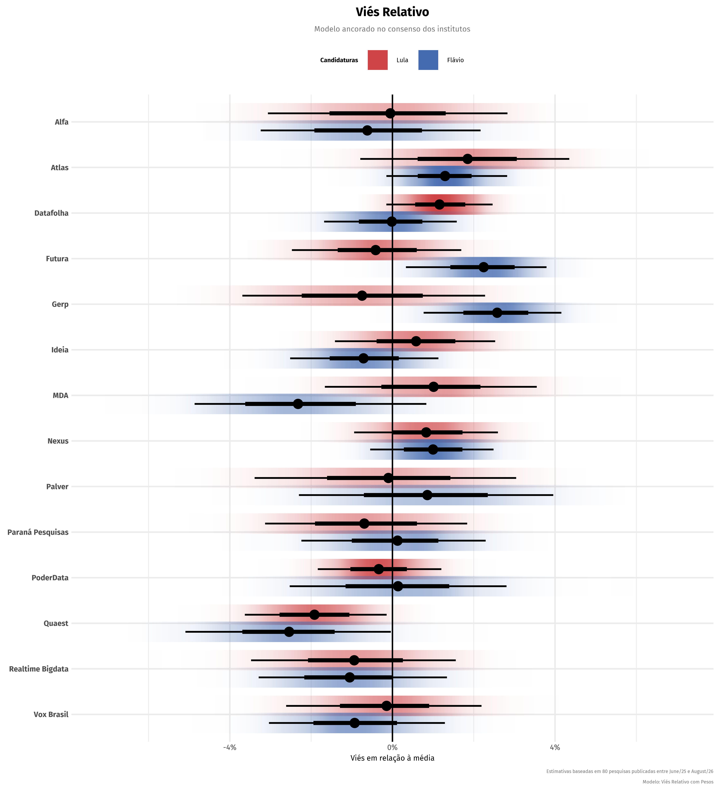

# 🇧🇷 Agregador - Eleições 2026

*Atualizado em: 15/08/2026*

## Introdução

À medida que as eleições presidenciais se aproximam, há um volume
crescente de pesquisas eleitorais publicadas, cada uma empregando
metodologias e desenhos amostrais distintos. O agregador emprega uma
metodologia rigorosa para filtrar esse excesso de dados e identificar o
nível subjacente de apoio a cada candidato.

Trata-se de um conjunto de modelos bayesianos calibrados para normalizar
os ruídos e viéses de cada instituto, incorporando fatores como o
desempenho das pesquisas na eleição anterior e assimetria de precisão de
acordo com o alinhamento político dos candidatos.

## Primeiro Turno

**Última pesquisa**:

## Segundo Turno

## Viés dos Institutos

