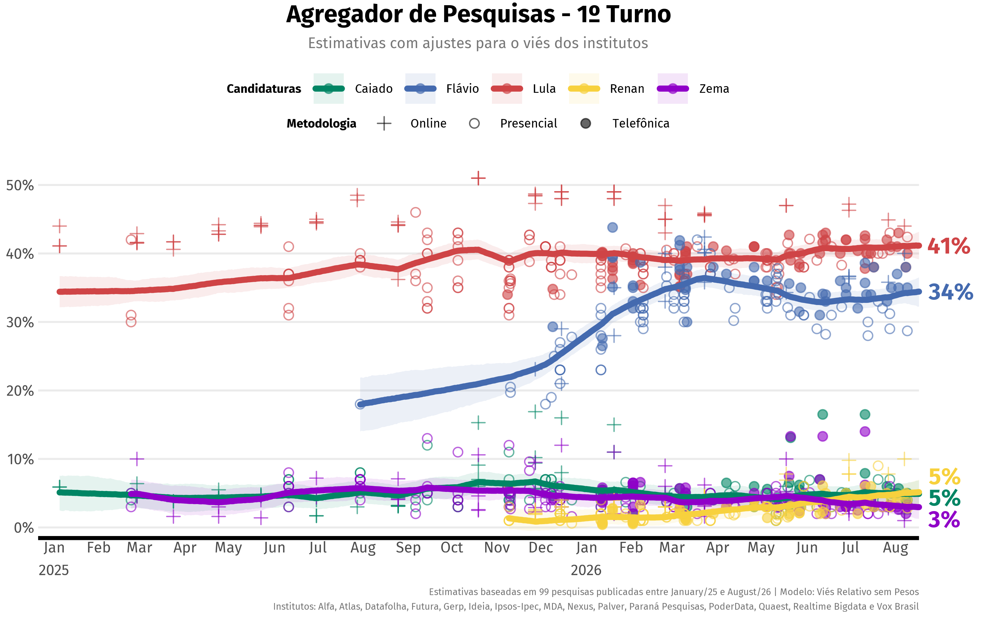
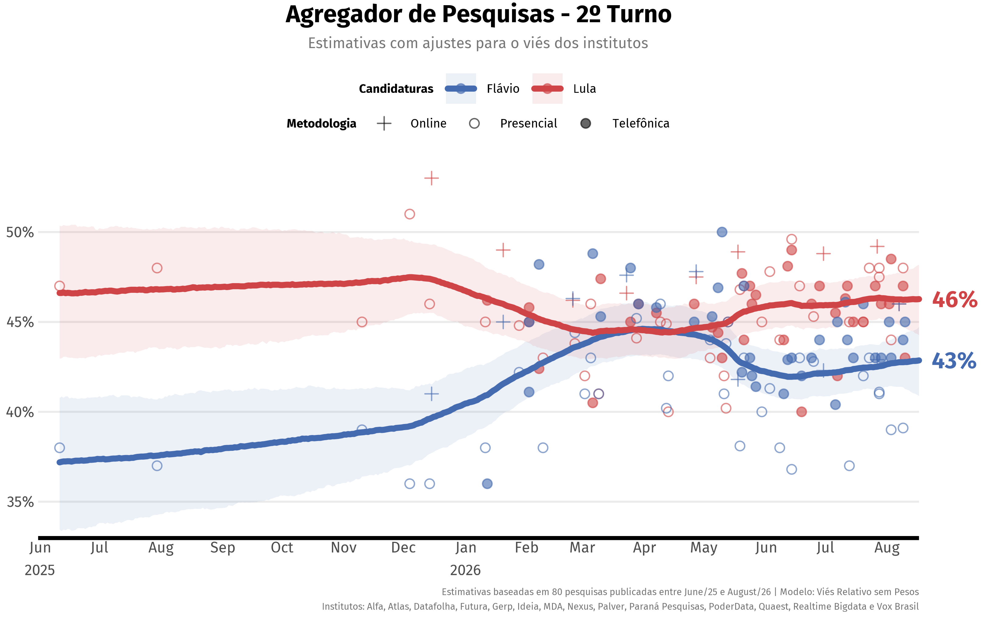
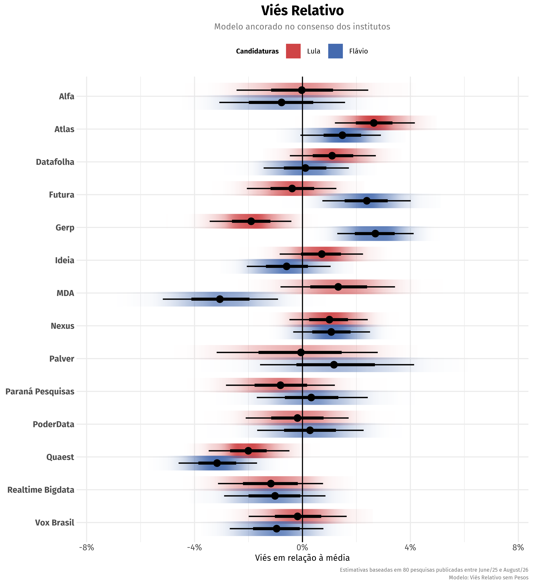
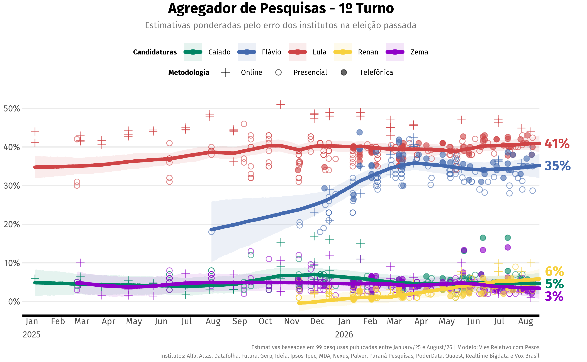
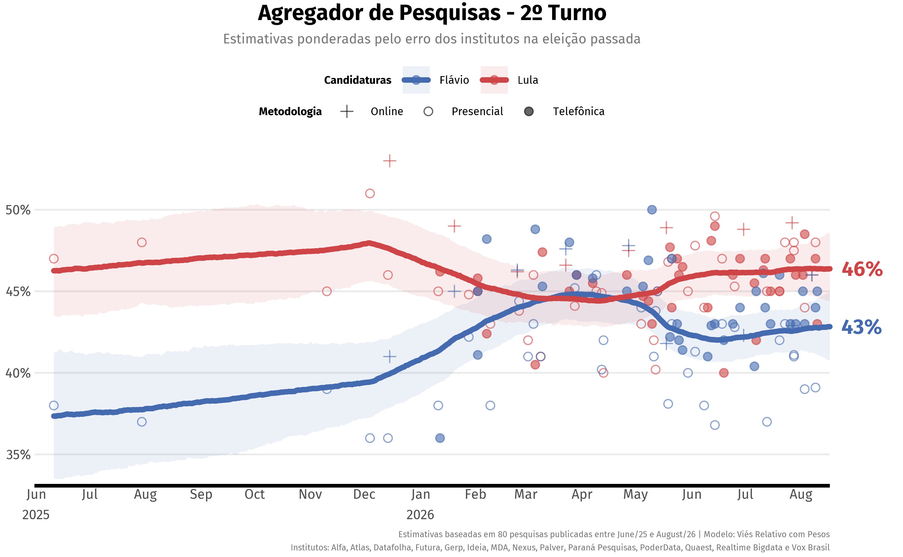
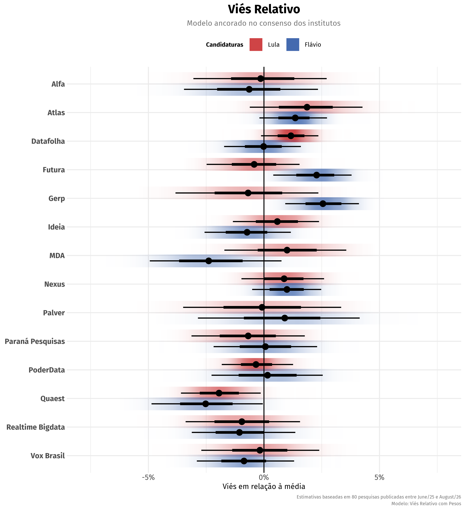
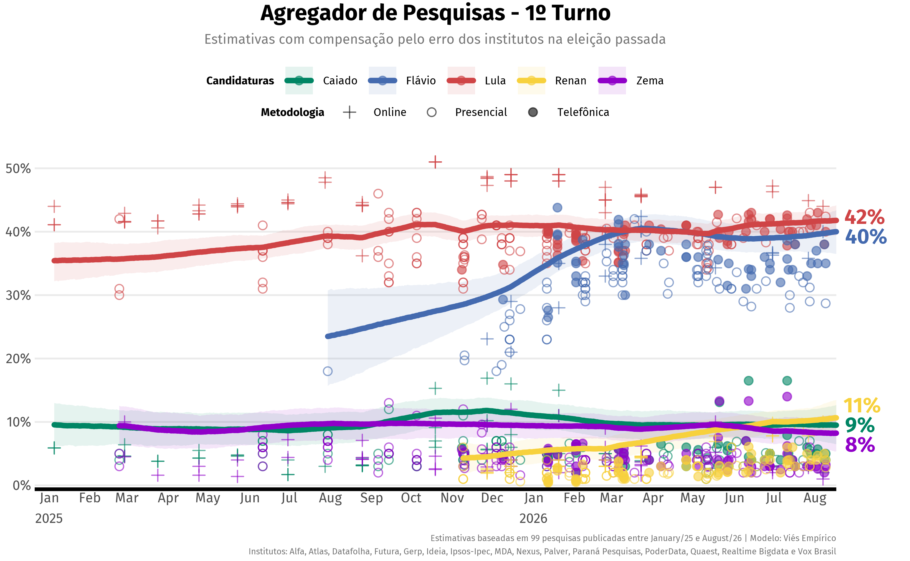
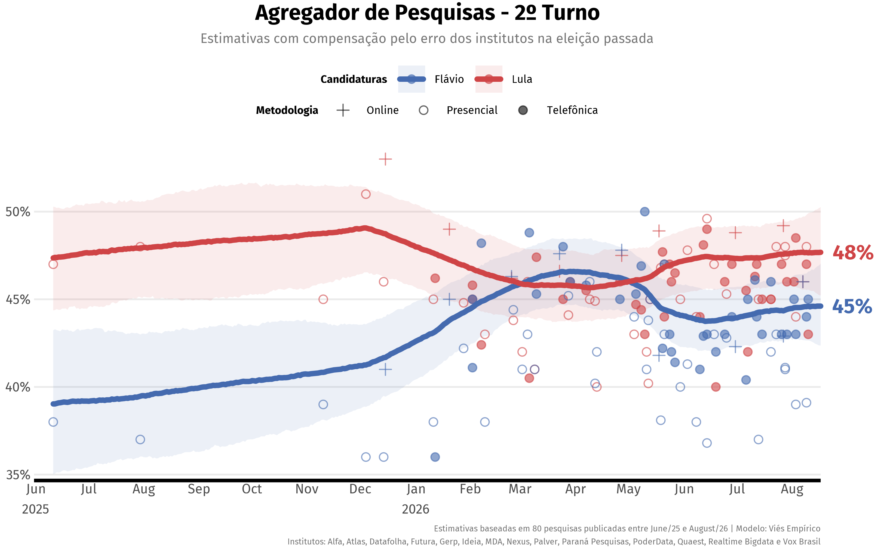
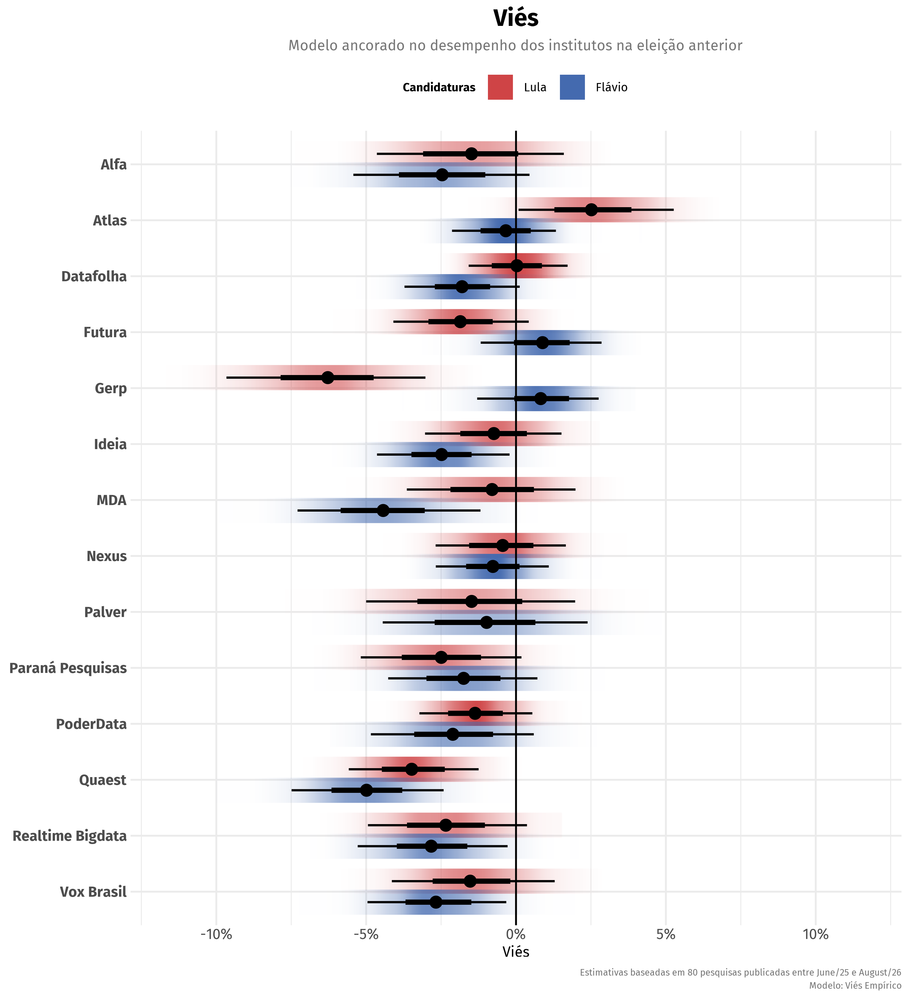

# Agregador Eleições 2026

**Última atualização: 17/08/2026**

## Introdução

Como interpretar os resultados de pesquisas com resultados divergentes?
O agregador emprega uma [metodologia
rigorosa](https://rnmag.github.io/agregR/index.html#methodology) para
tratar a enxurrada de dados divulgados no período eleitoral e estimar o
nível de apoio subjacente a cada candidato. Os modelos contemplam:

- Desempenho dos institutos na última eleição
- Vieses de acordo com o alinhamento político dos candidatos
- Vieses dos institutos em relação ao consenso
- Margens de erro incoerentes com o tamanho da amostra
- Erros não-amostrais (para além da margem de erro)

Esta página apresenta cenários eleitorais mais prováveis, mas `agregR` é
um pacote de [código aberto](https://github.com/rnmag/agregR) para o R
que pode ser
[instalado](https://rnmag.github.io/agregR/index.html#installation)
gratuitamente. Fique à vontade para explorar os mais de 10 cenários
disponíveis no banco de dados.

`agregR` oferece 3[^1] modelos que se diferenciam pela importância
atribuída ao desempenho dos institutos na última eleição. Eles são
apresentados abaixo em ordem do menos dependente dos dados históricos
para o mais dependente. Cada modelo é apresentado por um breve resumo, e
uma [explicação técnica
detalhada](https://rnmag.github.io/agregR/index.html#methodology) está
disponível na documentação.

Embora os modelos com dados históricos pareçam preferíveis, é importante
lembrar que desempenhos passados podem não se repetir, e institutos
podem adaptar suas metodologias entre uma eleição e outra. Os modelos se
complementam.

## Modelo 1: Viés Relativo sem Pesos

Este modelo não usa qualquer informação sobre o desempenho dos
institutos na última eleição, calculando vieses puramente com base nas
pesquisas deste ciclo eleitoral. Todos os institutos têm o mesmo peso.

## Modelo 2: Viés Relativo com Pesos

Este modelo equilibra o uso de dados históricos e de dados do cliclo
atual. Atribui pesos aos institutos de acordo com o desempenho na última
eleição, considerando o alinhamento político dos candidatos. O viés é
estimado em torno do consenso das pesquisas.

## Modelo 3: Viés Empírico

Este é o modelo mais vinculado ao passado. Além de atribuir pesos aos
institutos de acordo com o desempenho na última eleição, também compensa
(ou desconta) os candidatos com alinhamentos políticos mais prejudicados
(ou beneficiados) por cada instituto.

[^1]: O pacote contém mais 2 modelos com menor utilidade durante a
    campanha: o modelo **Retrospectivo** usa o resultado real da eleição
    para calcular retrospectivamente vieses e trajetórias para cada
    candidato, enquanto o modelo **Naive** é disponibilizado como uma
    curiosidade, pois não modela nenhum viés e é equivalente a tirar uma
    média simples das pesquisas.
