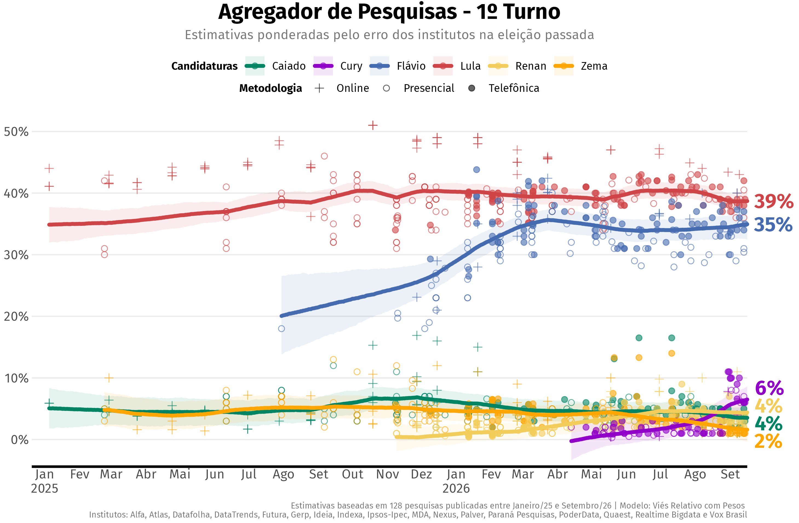
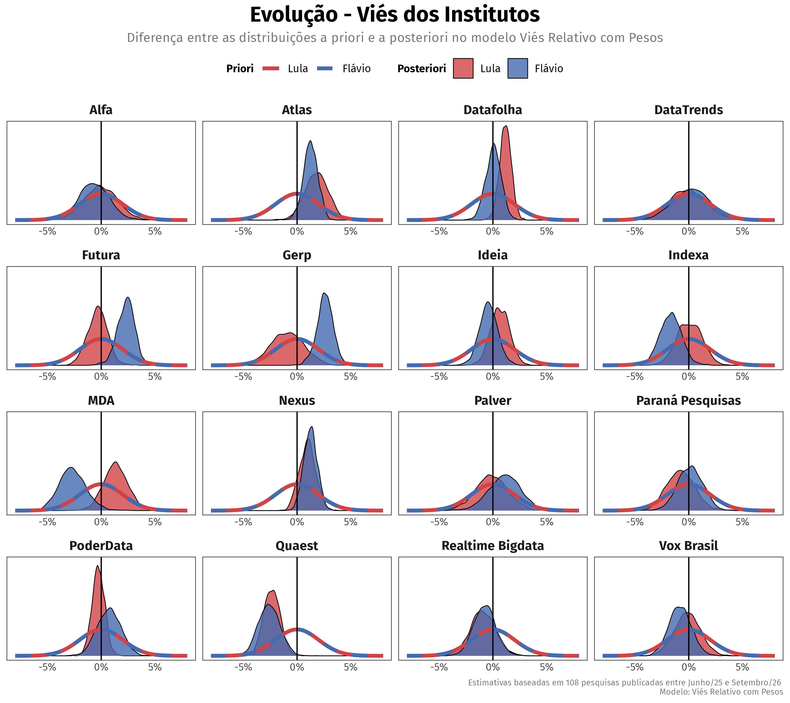
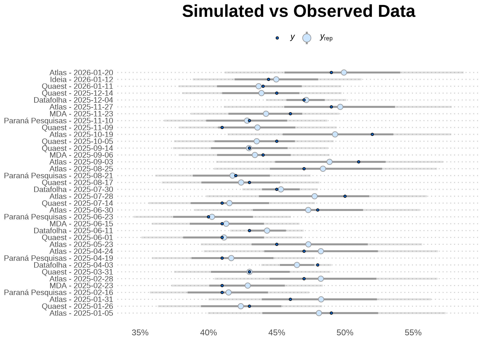

# agregR

**Dynamic measurement models to estimate latent vote from noisy polling
sources**

As presidential elections approach, Brazilian voters are confronted with
a growing volume of conflicting polling data from various institutes,
each employing distinct methodologies and sampling designs. `agregR`
provides the public with a rigorous framework to process the surfeit of
data and estimate the underlying level of support for each candidate.

The package implements a set of Bayesian state-space models in
[Stan](https://mc-stan.org/) to aggregate and normalize polling data,
extracting a stable signal from diverse, noisy, and possibly biased data
sources. `agregR` is able to automatically down-weight institutes with
historically poor accuracy while maintaining the flexibility to update
their evaluation based on current-cycle performance. It also features
specialized methods to account for:

- House effects relative to the consensus
- House effects based on past election performance
- Asymmetric accuracy based on candidates’ political alignment
- Institutes reporting inflated precision
- Heterogeneous errors for round 1 and round 2 elections
- Non-sampling errors, such as design effects and non-ignorable
  non-response bias

## Table of Contents

- [Installation](#installation)
  - [Dependencies](#dependencies)
- [Basic Usage](#basic-usage)
  - [Estimation](#estimation)
  - [Visualization](#visualization)
  - [Advanced Configuration](#advanced-configuration)
- [Methodology](#methodology)
  - [Introduction](#introduction)
  - [Data](#data)
  - [Conceptual Framework](#conceptual-framework)
  - [Models Overview](#models-overview)
- [Model Validation](#model-validation)
  - [Posterior Predictive Checks](#posterior-predictive-checks)
  - [Posterior Geometry](#posterior-geometry)
  - [Convergence](#convergence)
- [References](#references)

## Installation

You can install the development version of `agregR` with:

``` r
if (!require(pak)) install.packages("pak")
pak::pak("rnmag/agregR")
```

### Dependencies

`agregR` is built on [CmdStan](https://mc-stan.org/docs/cmdstan-guide/),
the state-of-the-art backend for Stan. Since CmdStan is not available on
CRAN ([and will likely never
be](https://discourse.mc-stan.org/t/what-is-the-difference-between-rstan-cmdstanr-and-bridgestan/39226/3)),
it needs to be installed separately. This one-time setup yields
substantial gains in compilation speed and sampling performance.

**Windows** users must first install
[RTools](https://cran.r-project.org/bin/windows/Rtools/) to enable C++
compilation. **MacOS** requires [Xcode Command Line
Tools](https://developer.apple.com/documentation/xcode/installing-the-command-line-tools/),
and **Linux** users should install the distribution-specific compiler
(e.g. on Ubuntu: `sudo apt install build-essential`).

After that, the most convenient way to install CmdStan is via the
`cmdstanr` interface.

``` r
# Install cmdstanr interface
install.packages("cmdstanr", repos = c("https://mc-stan.org/r-packages/", getOption("repos")))

# Install CmdStan
cmdstanr::install_cmdstan()
```

Optional step: check if the toolchain is complete.

``` r
# Make sure everything is in place
cmdstanr::check_cmdstan_toolchain()
```

## Basic Usage

### Estimation

The main function
[`rodar_agregador()`](https://rnmag.github.io/agregR/reference/rodar_agregador.md)
centralizes data preparation, model compilation, and sampling. It
returns the full `CmdStanMCMC` objects for diagnostics, along with tidy
data frames for house effects and daily voting estimates.

``` r
library(agregR)

# Execute the aggregation pipeline for a 2nd round scenario
results <- rodar_agregador(
  turno = 2,
  cenario = "Lula vs Tarcísio",
  modelo = "Viés Empírico"
)

# Daily voting estimates + poll data in tidy format
results$votos_estimados

# House effects in tidy format
results$vies_institutos

# Raw model object
results$modelo_bruto
```

### Visualization

The package includes a suite of plots designed for public communication.

#### 1. Voting Intentions

Visualizes the estimated voting intention for each candidate overlaying
the raw polling data.

``` r
grafico_agregador(results)
```



#### 2. House Effects

Visualizes the systematic bias for each institute, identifying outliers
and consistent directional skews.

``` r
grafico_vies(results, candidaturas = c("Lula", "Tarcísio"))
```


#### 3. Bayesian Updating Check

Visualizes how the data has informed the model by comparing prior
vs. posterior distributions for selected parameters.

``` r
grafico_priori_posteriori(results, tipo = "Viés", candidaturas = c("Lula", "Tarcísio"))
```



### Advanced Configuration

The package offers configuration functions for fine-grained control over
plots and models. Configuration values can be stored in new objects
using the functions
[`configurar_agregador()`](https://rnmag.github.io/agregR/reference/configurar_agregador.md),
[`configurar_prioris()`](https://rnmag.github.io/agregR/reference/configurar_prioris.md)
and
[`configurar_grafico()`](https://rnmag.github.io/agregR/reference/configurar_grafico.md).
Alternatively, they can be passed directly as lists to the appropriate
arguments.

``` r
# Config passed as list: longer run with tighter priors for non-sampling error
results_custom <- rodar_agregador(
  turno = 2,
  cenario = "Lula vs Tarcísio",
  config_agregador = list(stan_chains = 4,
                          stan_iter = 2000,
                          stan_warmup = 2000),
  config_prioris = list(sd_tau_priori = 0.01)
)

# Config passed as function: custom color and custom symbols
grafico_agregador(
  results, 
  config_grafico = configurar_grafico(
    cores_candidaturas = c("Tarcísio" = "yellow"),
    simbolos = c("Presencial" = 19, "Online" = 2, "Telefônica" = 4)
  )
)

# Config passed as object: custom color
config_custom <- configurar_grafico(cores_candidaturas = c(Lula = "green"))

grafico_agregador(results, config_grafico = config_custom)
```

## Methodology

### Introduction

We are interested in performing inference on the **latent state** of
public opinion: the dynamic, unobserved level of support for each
candidate. Polls are periodic snapshots of this state, but the pictures
are distorted and grainy.

An apt analogy is a GPS receiver navigating an area with spotty
connectivity. It receives sparse, conflicting pings from different
satellites, each with its own uncertainty due to equipment
miscalibration or inherent manufacturer bias. The system must achieve
three objectives:

1.  **Data Reconciliation**: It must filter the noise from competing
    sources to resolve a definitive vehicle position.
2.  **Path Estimation**: It must reconstruct the trajectory between data
    points, since movement continues even when satellites lose track of
    the vehicle.
3.  **Joint Parameter Updating**: As new data arrives, the system must
    simultaneously update the vehicle’s position and re-evaluate the
    reliability of each satellite.

Much like satellites, polling institutes are often miscalibrated. Their
readings contain noise introduced by different sampling designs,
weighting protocols, and question wording, among other factors. `agregR`
shares the same objectives as the GPS receiver:

1.  **Data Reconciliation**: It filters the noise from competing
    pollsters to isolate the latent state of candidate support.
2.  **Path Estimation**: It reconstructs the trajectory of public
    opinion during polling gaps, ensuring a continuous estimate even
    when data is sparse.
3.  **Joint Parameter Updating**: As new polls are published, it
    dynamically updates candidate support levels while simultaneously
    re-evaluating the reliability of each institute.

### Data

Data collection is deliberately *unselective*. Instead of subjectively
deciding which institutes produce high quality polls, we trust the
models to separate the wheat from the chaff.

Polls enter the model with checks on their sample size in order to avoid
undue influence from institutes claiming inflated precision. We
calculate an *implied* $n$ derived from the published margin of error
and compare it to the reported sample size. We use the most conservative
figure $n_{eff}$ to compute specific standard errors for each candidate
$c$ according to their vote share $v_{i,c}$ in poll $i$:

$$\sigma_{i,c} = \left. \sqrt{}\frac{v_{i,c}\left( 1 - v_{i,c} \right)}{n_{eff{\lbrack i\rbrack}}} \right.$$

Historical data is sourced from [Poder360’s polling
database](https://basedosdados.org/dataset/fb38dbe8-03ce-46b4-a6b7-638ade03999c?table=b6df9e1c-cbcb-4dbd-893b-8645a51773e6).

### Conceptual Framework

The methods implemented by `agregR` build on Jackman (2009, Chapter 9).
They are variously known as state-space models (SSM), dynamic linear
models (DLM) or Kalman filters and consist of two integrated components:

1.  A **state model** that estimates the underlying trajectory of
    candidate support in the periods between polling releases.
2.  A **measurement model** that filters incoming observations and
    updates institute-specific biases. It decomposes uncertainty into
    sampling error ($\sigma$), house effects ($\delta$), and an
    additional non-sampling error term ($\tau$) inspired by Heidemanns,
    Gelman & Morris (2020).

#### State Model

The latent voting intention for each candidate updates daily according
to a local linear trend. The evolution of the latent state through time
$t$ for candidate $c$ is governed by the **level component** $\mu_{t,c}$
and influenced by the **trend component** $\nu_{t,c}$.

The level $\mu_{t,c}$ is defined by the previous state $\mu_{t - 1,c}$
plus the trend $\nu_{t - 1,c}$, subject to stochastic level innovations
$\eta_{t,c}$. The trend itself evolves as a random walk, allowing the
momentum of the campaign to shift over time, controlled by trend
innovations $\zeta_{t,c}$.

$$\begin{pmatrix}
\mu_{t,c} \\
\nu_{t,c}
\end{pmatrix} = \begin{pmatrix}
1 & 1 \\
0 & 1
\end{pmatrix}\begin{pmatrix}
\mu_{t - 1,c} \\
\nu_{t - 1,c}
\end{pmatrix} + \begin{pmatrix}
\eta_{t,c} \\
\zeta_{t,c}
\end{pmatrix}$$

The volatility parameters govern the “stiffness” of the aggregator,
where daily innovations $\eta_{t,c}$ are regularized by a
candidate-specific scale $\omega_{\eta,c}$. Pooling accross the time
series prevents over-fitting to noise while allowing the model to adapt
when consistent evidence of a shift in public opinion emerges.

\$\$ \eta\_{t, c} \sim N\left(0, \omega^2\_{\eta, c}\right) \\\\
\zeta\_{t, c} \sim N\left(0, \omega^2\_{\zeta, c}\right) \$\$

#### Measurement Model

When polling data $i$ for candidate $c$ is available, the observed
result $y_{i,c}$ from institute $j$ at time $t$ is modeled as a function
of the latent state $\mu_{t{(i)},c}$ and house effects
$\delta_{j{(i)},k{(i)},p{(c)}}$:

$$y_{i,c} = \begin{pmatrix}
1 & 0
\end{pmatrix}\begin{pmatrix}
\mu_{t{(i)},c} \\
\nu_{t{(i)},c}
\end{pmatrix} + \delta_{j{(i)},k{(i)},p{(c)}} + \varepsilon_{i,c}$$

where

$$\varepsilon_{i,c} \sim N\left( 0,\sqrt{\sigma_{i,c}^{2} + \tau_{j{(i)},k{(i)},p{(c)}}^{2}} \right)$$

with subscripts linking poll $i$ and candidate $c$ to relevant
covariates:

- $t(i)$: **Date** of fieldwork ($t \in \{ 1,\ldots,T\}$).
- $j(i)$: **Polling institute** ($j \in \{ 1,\ldots,J\}$).
- $k(i)$: **Election round** ($k \in \{ 1,2\}$).
- $p(c)$: **Political alignment** for candidate $c$
  ($p \in \{\text{left, right, other}\}$).

Critically, $\sigma$ represents a theoretical lower bound of
uncertainty, whereas $\tau$ captures the excess empirical variance
required to account for the data’s observed dispersion.

In summary, the measurement model identifies three sources of
uncertainty for polls:

1.  **Sampling Error ($\sigma_{i,c}$)**: The inherent uncertainty
    derived from the effective sample size of the poll $i$ and the
    support level for candidate $c$.
2.  **House Effects ($\delta_{j,k,p}$)**: A systematic deviation
    specific to institute $j$, conditional on the election round $k$ and
    the candidate’s political alignment $p$.
3.  **Non-Sampling Error ($\tau_{j,k,p}$)**: An additional error
    parameter capturing uncertainty extrinsic to random sampling (e.g.,
    design effects, non-ignorable non-response bias), also localized by
    institute $j$, round $k$, and political alignment $p$.

### Models Overview

Based on the methods described above, `agregR` offers a set of
specialized models that differ in their assumptions regarding house
effects ($\delta$) and non-sampling error ($\tau$) estimation:

- **Anchoring**: Since $\mu$ and $\delta$ are not jointly identified,
  house effects $\delta_{j,k,p}$ follow a hierarchical prior centered
  either on a consensus anchor (sum-to-zero) or on historical/actual
  electoral results. This prevents individual polls from
  disproportionately pulling the latent trend unless supported by
  cumulative evidence.
- **Weighting**: Models using localized non-sampling errors
  $\tau_{j,k,p}$ as prior means effectively perform automated weighting.
  This approach penalizes institutes with higher Root Mean Square Error
  (RMSE) in the last election while maintaining the flexibility to
  update its estimates based on current-cycle data.

Specific values for priors can be accessed (and modified) by the
[`configurar_prioris()`](https://rnmag.github.io/agregR/reference/configurar_prioris.md)
function, and details are available in the function’s documentation:
[`?configurar_prioris`](https://rnmag.github.io/agregR/reference/configurar_prioris.md).

| Model                                                    | House Effects Anchor ($\delta$)                                                     | Non-Sampling Error Prior ($\tau$)                                               |
|:---------------------------------------------------------|:------------------------------------------------------------------------------------|:--------------------------------------------------------------------------------|
| **Viés Relativo com Pesos** (*Weighted Relative Bias*)   | Consensus $\left( \sum_{j}\delta_{j,k,p} = 0 \right)$                               | Last election $\tau_{j,k,p}$ (past RMSE $\left. \rightarrow\tau \right.$ prior) |
| **Viés Relativo sem Pesos** (*Unweighted Relative Bias*) | Consensus $\left( \sum_{j}\delta_{j,k,p} = 0 \right)$                               | Global $\tau$ shared by all institutes                                          |
| **Viés Empírico** (*Empirical Bias*)                     | Last election $\delta_{j,k,p}$ (past bias $\left. \rightarrow\delta \right.$ prior) | Last election $\tau_{j,k,p}$ (past RMSE $\left. \rightarrow\tau \right.$ prior) |
| **Retrospectivo** (*Retrospective*)                      | Actual election result $\left( \mu_{T} \right)$                                     | Global $\tau$ shared by all institutes                                          |
| **Naive**                                                | None                                                                                | None                                                                            |

## Model Validation

### Posterior Predictive Checks

Every Stan model in `agregR` includes a `generated quantities` block,
enabling Posterior Predictive Checks (PPC). By simulating $y_{rep}$ from
the posterior distribution, users can verify the model’s calibration
against real-world data. The example below demonstrates this using the
`bayesplot` package.

``` r
library(bayesplot)

# Setup
cand  <- "Lula"
modelo_cand <- results$modelo_bruto[[cand]]
color_scheme_set("mix-brightblue-darkgray")

# Observed data
y <- results$votos_estimados |>
  filter(!is.na(percentual_pesquisa) & candidatura == cand) |>
  pull(percentual_pesquisa)

# Simulated data
y_rep <- modelo_cand$draws("perc_simulado", format = "matrix")

# Prepare plot labels
pesquisa_id <- results$votos_estimados |>
  filter(!is.na(percentual_pesquisa) & candidatura == cand) |>
  pull(pesquisa_id)

# Plot observed vs simulated data
ppc_intervals(y, y_rep, prob = 0.67, prob_outer = 0.95) +
  scale_x_continuous(labels = pesquisa_id,
                     breaks = seq_along(pesquisa_id)) +
  scale_y_continuous(labels = scales::label_percent()) +
  labs(title = "Simulated vs Observed Data") +
  xaxis_title(FALSE) +
  coord_flip() +
  theme_minimal() +
  theme(plot.title = element_text(face = "bold", size = 18, hjust = .5),
        panel.grid = element_blank(),
        panel.grid.major.y = element_line(linetype = "dotted", color = "gray80"),
        axis.text.y = element_text(size = 8),
        legend.position = "top")
```



### Posterior Geometry

Parameter distributions are standardized using Non-Centered
Parametrization (NCP) (McElreath, 2020, Chapters 13–14). This flattens
posterior geometry and addresses the “funnel” problem common in
hierarchical models, significantly improving sampling efficiency and
virtually eliminating divergent transitions in standard scenarios (Stan
Development Team, 2025, Efficiency Tuning: Reparametrization).

``` r
# Posterior geometry for selected mu and delta parameters
mcmc_scatter(modelo_cand$draws(),
             pars = c("mu[1]", "delta[1]"),
             np = nuts_params(modelo_cand), # no divergences to display
             alpha = 0.1) +
  stat_density_2d(color = "black")
```


### Convergence

The MCMC chains demonstrate robust convergence, with the following plot
illustrating typical Effective Sample Size (ESS) and R-hat values.
Notably, many parameters exhibit an ESS exceeding the nominal number of
post-warmup iterations (blue line), a result of anti-correlated draws
that further underscores high sampling efficiency.

``` r
# ESS (bulk) vs R-hat
ggplot(modelo_cand$summary(), aes(x = ess_bulk, y = rhat)) +
  geom_point(alpha = 0.3) +
  geom_hline(yintercept = 1.01, linetype = "dashed", color = "red") +
  geom_vline(xintercept = 400, linetype = "dashed", color = "red") +
  geom_vline(xintercept = 2000, linetype = "dashed", color = "blue") +
  labs(title = "Convergence Diagnostics",
       subtitle = "Reference values: R-hat < 1.01 | ESS (bulk) > 4 x 100 | Iterations (post-warmup): 4 x 500)",
       x = "Effective Sample Size (bulk)",
       y = "R-hat") +
  theme_minimal() +
  theme(text = element_text(family = "Fira Sans"),
        plot.title = element_text(face = "bold", size = 18, hjust = .5),
        plot.subtitle = element_text(hjust = .5, color = "#777777"))
```


## References

- Heidemanns, H., Gelman, A., & Morris, G. (2020). *An Updated Dynamic
  Bayesian Forecasting Model for the 2020 Election*. Harvard Data
  Science Review.
- Jackman, S. (2009). *Bayesian Analysis for the Social Sciences*.
  Wiley.
- McElreath, R. (2020). *Statistical Rethinking*. CRC Press.
- Stan Development Team. (2025). *Stan User’s Guide, Version 2.38
  (Efficiency Tuning: Reparametrization)*. Retrieved from
  <https://mc-stan.org/docs/stan-users-guide/efficiency-tuning.html#reparameterization.section>
